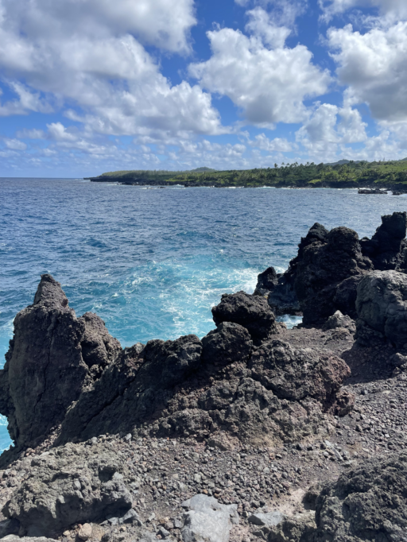
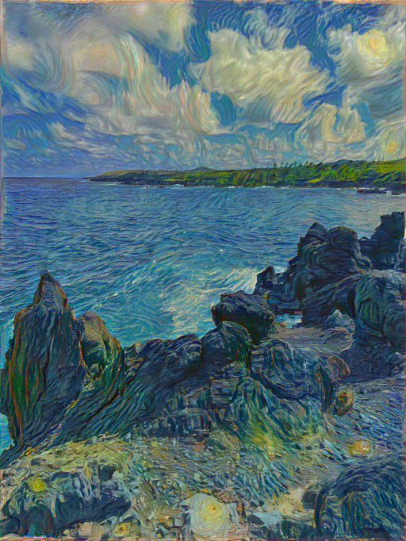

# CS445 Computational Photography Final Project
University of Illinois  

<ins>Group members:</ins>  
* Matt Poteshman (**mrp12**)  
* Paul Lambert (**lamber10**)  

## Background
Project information and ideas. Texture transfer, but from talented artists! 

<p align="center">
  
  
</p>

*Neural Style Transfer (NST) applied to a photograph of Maui's Waiʻānapanapa State Park, with style transfer from Van Gogh's* Starry Night


## Instructions
This project requires Python 3.10+.

To build and run the project, first initialize your environment using your preferrred Python package manager:

#### Conda:
```bash
conda env create -f environment.yml
conda activate finalproj
```

The `environment.yml` already includes pip dependencies, so no additional pip install is needed. 

#### PIP:
```bash
python -m venv .myvenv
source .myvenv/bin/activate
pip install -r requirements.txt
```

Note: CUDA version 12.4 is required for this environment. If using PIP, make sure the GPU-accelerated versions of PyTorch are installed.


### Neural Style Transfer
```bash
python src/nst.py
    --input '<input_path.jpg>' # image to be altered
    --style '<style_path.jpg>' # style source image (default: 'images/art/starry_night.jpg')
    --gamma # novel color preservation weight on loss function (optional, default `1e5`)
    --color_control` # color content preservation (optional, default `0.7`)
```

NST uses a pretrained VGG19 model and performs optimization during inference time on each input-style image pair. This can lead to longer generation times without CUDA. 

### CycleGAN

CycleGAN needs a model to run inference. Trained models are ~300mb and can be provided upon request.

**To train:**  
```
python src/cyclegan.py train 
    --style_dir "images/art/vangogh/" 
    --epochs 100 
    --batch_size 1 
    --lr 0.0002
```    

**Inference:**  
```bash
python src/cyclegan.py generate 
    --input '<input_image.jpg>'
    --output '<output_image.jpg>'
    --checkpoint '<path/to/checkpoint.pth>'
    --direction # AtoB or BtoA

python src/cyclegan.py generate 
    --input '<input_directory>'
    --output '<output_directory>'
    --checkpoint '<path/to/checkpoint.pth>'
    --direction # AtoB or BtoA 
```


## Sources

### Art Sources

[Van Gogh's works](https://www.nga.gov/collection/artist-info.1349.html#works)

#### Currently not used
* https://drive.google.com/drive/folders/1CglMyDFXJFNpDt3ebstOPYVwnVvMNv6g
* https://www.reddit.com/r/DataHoarder/comments/d0wuae/50k_images_from_the_art_institute_of_chicago/
* https://www.reddit.com/r/TheFrame/comments/10cu8hg/over_400_4k_opensource_artworks_from_around_the/


## License

This project is licensed under the [University of Illinois/NCSA Open Source License](license.txt). See [license.txt](license.txt) for details.
